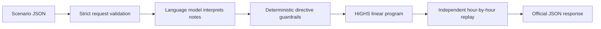

# GridWise

An implementation of the BUP CSE Fest 2026 preliminary challenge: interpret operator notes with a real language model, validate the extracted directives, and return a verified minimum-cost 24-hour campus energy schedule.

The judge endpoints are `GET /health` and `POST /optimize-energy`. Interactive request documentation is at `/docs`.

## Quickstart

Requires Python 3.12. From this repository:

```bash
python3 -m venv .venv
source .venv/bin/activate
python -m pip install -r requirements.lock
cp .env.example .env
```

Edit `.env` and set `LLM_API_KEY` to your provider credential. The default connection is OpenAI with `gpt-4.1-mini`. The API sends the synthetic operator notes and battery parameters to that configured provider. It does not send the full hourly scenario.

```bash
python main.py
```

In a second terminal:

```bash
curl --fail http://localhost:8000/health
curl --fail-with-body http://localhost:8000/optimize-energy \
  -H 'Content-Type: application/json' \
  --data-binary @data/sample_request.json
```

A configured service returns `{"status":"ok"}` from `/health`. Missing model credentials produce HTTP 503 readiness and a controlled HTTP 500 for optimization. Health checks test local configuration, not remote provider credentials or quota; validate those with a real optimization request. No key is included in this project.

`python maibn.py` also works for compatibility with the workspace's original filename. To use Uvicorn directly: `python -m uvicorn main:app --host 0.0.0.0 --port 8000`.

## Configuration

Environment variables take precedence over `.env`.

| Variable | Default | Purpose |
| --- | --- | --- |
| `LLM_API_KEY` | empty | Provider credential; falls back to `OPENAI_API_KEY` |
| `LLM_BASE_URL` | `https://api.openai.com/v1` | Base URL of an OpenAI-compatible API |
| `LLM_MODEL` | `gpt-4.1-mini` | Provider model identifier |
| `LLM_JSON_MODE` | `json_schema` | `json_schema` for strict Structured Outputs; `json_object` for compatible providers without schema enforcement |
| `LLM_TIMEOUT_SECONDS` | `10` | Per-provider-request timeout |
| `LLM_MAX_ATTEMPTS` | `2` | Maximum attempts, including any output repair |
| `LLM_MAX_OUTPUT_TOKENS` | `1800` | Output limit; supported range 256–4096 |
| `PORT` | `8000` | HTTP service port |
| `DATABASE_URL` | empty outside Docker | SQLAlchemy PostgreSQL connection URL |
| `POSTGRES_DB` | `gridwise` | Compose database name |
| `POSTGRES_USER` | `gridwise` | Compose database user |
| `POSTGRES_PASSWORD` | none | Compose database password; set it in `.env` |

The interpreter has a hard 22-second budget across attempts; the API has a 28-second deadline. Provider/model choice and quota determine live latency. The guide's 5-second p95 target has **not** been verified against a live provider here.

For another compatible hosted provider, set its base URL, model, and key. Its Chat Completions implementation must support the requested JSON mode and `max_completion_tokens`. Model capability and paraphrase accuracy must be checked before submission.

For a local Ollama service, set `LLM_BASE_URL=http://127.0.0.1:11434/v1`, choose an installed language-capable model, and set `LLM_JSON_MODE=json_object`. Loopback providers may omit the key. When accessing a host model from Docker, use an address reachable from the container; `localhost` inside the container is the container itself. See [the provider notes](docs/llm_prompt.md) for integration details. Local model availability and inference latency remain your responsibility.

## Validation and public samples

Install the development tools and run the suite:

```bash
source .venv/bin/activate
python -m pip install -r requirements-dev.txt
python -m pytest -q
```

Run the optimizer against all ten public reference interpretations without a provider:

```bash
python scripts/check_samples.py
```

Expected result: **10/10 cases passed**, with all reference optimal costs matched within 0.01 BDT. This offline command verifies mathematical scheduling and replay; it does not test language understanding. The API never reads public fixtures or substitutes them for model output.

Once a real model is configured and the service is running, test the complete pipeline:

```bash
python scripts/check_samples.py --url http://localhost:8000
```

The live command compares directive semantics, independently replays the resulting plan against the supplied ground truth, and checks optimal cost. Exact hourly actions and explanations can differ from the reference. It exits nonzero on any failure.

Tests cover all public cases, strict guardrails, mocked provider requests and repair, API failures, infeasible inputs, independent replay mutation checks, and randomized small scenarios with an independent dynamic-programming optimal-cost oracle. Mocked tests do not establish real-model semantic accuracy.

`data/sample_request.json` is the first official sample input. `data/sample_response.json` is the optimizer's verified result using that sample's reference interpretation. The original ten-case pack is in `data/public_sample_cases.json`.

## Architecture



- **LLM:** One call interprets all 1–3 notes into the six allowed types. The prompt defines time windows, percentages, reserves, distractors, and the separation of operator data from model instructions. A malformed output may receive a bounded repair attempt. There is no production phrase-matching or sample-lookup fallback.
- **Guardrails:** Reject unknown types/fields, incorrect note order/count, invalid `applies` semantics, unsorted/duplicate hours, nonfinite numbers, invalid solar factors, or reserves above capacity. Raw model output never reaches the solver.
- **Optimization:** SciPy's HiGHS solver minimizes grid cost. Two subsequent LPs fix the preceding optimum by equality and minimize peak grid intake, then battery throughput. Optional tie-break failure retains the earlier optimum.
- **Replay:** A separately implemented checker reconstructs effective solar, all directives, energy balance, battery transitions, rate limits, final neutrality, and totals. The API returns a schedule only after replay succeeds.
- **Caching:** A bounded in-memory cache stores only validated model interpretations keyed by exact notes and all battery parameters. Every request still solves and replays its own hourly data. Scenario IDs never determine an answer.

For each hour `h`, the solver uses grid energy `g[h]`, solar used `s[h]`, signed battery change `delta[h]`, and battery energy `E[h]`:

```text
minimize       sum(tariff[h] * g[h])
energy balance g[h] + s[h] - delta[h] = demand[h]
battery state  E[h] = E[h-1] + delta[h]
solar          0 <= s[h] <= effective_solar[h]
battery        active_reserve[h] <= E[h] <= capacity
rate limits    -discharge_limit[h] <= delta[h] <= charge_limit[h]
grid           0 <= g[h] <= active_grid_cap[h]
neutrality     E[23] = initial_energy
```

`E[-1]` denotes initial energy. Positive delta means charge; negative delta means discharge; zero means idle. Unit charging/discharging efficiency is prescribed by the challenge, so this signed-variable LP is exact and permits only one action per hour. Surplus solar may be curtailed; grid export is unavailable.

## Docker and deployment

Requires Docker, which was not installed in the development environment used to prepare this project. Container execution and a public deployment are therefore still unverified.

```bash
docker build -t gridwise:1.0.0 .
docker run --rm --name gridwise -p 8000:8000 --env-file .env gridwise:1.0.0
```

Or run `cp .env.example .env`, replace `POSTGRES_PASSWORD` with a local secret, and run `docker compose up --build -d`. Compose starts PostgreSQL as `db`, waits for its health check, and stores database files in the persistent `gridwise-db-data` volume. The application connects to `db`, not `localhost`. The image runs as an unprivileged user, binds to `0.0.0.0`, and excludes `.env`, tests, sample answers, and local development files. Its health check uses `PORT`.

The application creates the required tables automatically on startup. Successful verified optimization runs are stored with their scenario, battery configuration, operator notes, validated directives, and hourly plan. Sample data is not seeded automatically.

For the mandatory pullable fallback, publish a versioned image to your registry, then replace `YOUR_ACCOUNT` in the commands below with the actual registry namespace:

```bash
docker tag gridwise:1.0.0 YOUR_ACCOUNT/gridwise:1.0.0
docker push YOUR_ACCOUNT/gridwise:1.0.0
docker pull YOUR_ACCOUNT/gridwise:1.0.0
docker run --rm -p 8000:8000 --env-file .env YOUR_ACCOUNT/gridwise:1.0.0
```

For common x86 cloud hosts when building on Apple Silicon, build and publish an image for the target architecture using `docker buildx build --platform linux/amd64 -t YOUR_ACCOUNT/gridwise:1.0.0 --push .`. Prefer an exact image digest in the final submission.

Deploy the Dockerfile on a host with outbound access to the configured model provider. Configure the environment variables as deployment secrets, expose the selected port, and verify both endpoints externally using `scripts/check_samples.py --url https://YOUR_SERVICE`. The guide requires no authentication on the judge endpoints. A live endpoint, registry image, GitHub repository, and video have not been published by this implementation task.

The guide's deliverables and a recording script are in [docs/submission.md](docs/submission.md).

## Assumptions and limits

- Input prices, demand, solar, and battery quantities must be finite and nonnegative. Numeric strings and booleans are rejected. Unordered hourly inputs are sorted after checking all 24 unique hours.
- Overlapping reserve requirements take the maximum; overlapping grid caps take the minimum; charge/discharge prohibitions accumulate.
- The supplied specification does not resolve overlapping solar reductions. This implementation uses the smallest remaining fraction of the **original** forecast, rather than multiplying reductions. Both solver and replay follow this documented assumption.
- Time windows are start-inclusive and end-exclusive. For explicitly wrapping daily windows the model is instructed to return covered hours in ascending order. Clarify ambiguous windows with organizers if they appear in future requirements.
- The guardrails verify structure and numeric validity, not semantic truth. A well-formed but wrongly interpreted note can still be wrong; live sample and paraphrase testing is essential.
- Missing or failing providers produce controlled errors. Infeasible interpreted constraints return 422. Malformed requests return 400. Errors do not expose raw provider bodies, credentials, or stack traces.
- Model quotas, provider availability, hosting, and final public accessibility require deployment-specific verification. There are no baked-in credentials or offline production interpreter.

## Dependencies and credits

Python, FastAPI, Pydantic, Uvicorn, HTTPX, NumPy, SciPy/HiGHS, python-dotenv, and pytest provide the service, validation, transport, solver, and test infrastructure. Runtime versions are pinned in `requirements.lock`; direct dependencies are in `requirements.txt`. The LLM provider is configurable and must be credited with the actual model used in your submission. Codex assisted implementation and tests. The problem specification and public examples were supplied by BUP CSE Fest 2026.

Reference documentation: [FastAPI lifespan](https://fastapi.tiangolo.com/advanced/events/), [SciPy linprog](https://docs.scipy.org/doc/scipy/reference/generated/scipy.optimize.linprog.html), [OpenAI Structured Outputs](https://developers.openai.com/api/docs/guides/structured-outputs), and [GPT-4.1 mini](https://developers.openai.com/api/docs/models/gpt-4.1-mini).
